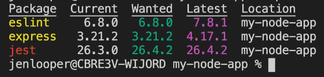
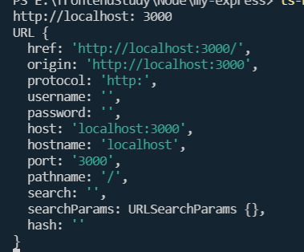

# Node

## 简介

- Node是一个基于V8的JavaScript运行环境
- 非阻塞式I/O，事件驱动，能够高效处I/O密集型应用

## 下载

1. 官网下载，不推荐，版本更新很快，不易版本管理
2. nvm-windows，在github安装nvm，方便管理版本
   1. `nvm list available ` 查看所有版本
   2. nvm install 版本号

## package.json

官方建议script命名，当然这是按需添加的

```js
{
  script: {
    start: "node ./dist/index.js",
    test: "jest",
    build: "tsc",
    lint: "eslint",
  },
  "dependencies":{
      "eslint": "^6.8.0"
  }
};

```

dependencies中版本说明：

- ^表示允许中号版本更新
- ~表示允许小号版本更新
- *代替大版本号表示允许大版本更新

## package-lock.json

可以锁定依赖项版本，确保工作环境稳定。锁定不需要的更新，手动管理更新

- npm outdated  可以检查依赖的更新信息
- 
- 黄色表示有更新，但不在你package.json更新范围内
- 红色表示在package.json更新范围内，可以放心更新

## 使用TS编写node

使用ts编写的项目可能不能运行，会报`找不到名称 "require"。是否需要为节点安装类型定义? 请尝试使用 `npm i --save-dev @types/node`。ts(2580)`

因为require这些是node的东西，我们需要安装nodejs的声明文件

- npm i @types/node typescript ts-node -D

然后想要执行ts文件，还需要安装ts-node，用`ts-node`命令执行

- npm i ts-node -g

## npm

全称`Node Package Manager`，即软件包管理器

- npm audit   列出依赖包中的漏洞
- npm audit fix  修复项目中版本范围内的漏洞
- npm audit fix --force  允许更新版本范围外的漏洞

## fs

- readdir  读取文件

## path

- jion
- __dirname

## http

- createServer 创建一个服务器
- listen  监听一个端口

## Query String

- parse  很方便的处理get请求问号后的数据 返回一个json

## url

专门用来解析地址

- parse(地址， true【可选，需不需要解析query部分】)  **已经废弃**
- 现在可以直接`new URL` 里面有我们想要的数据
- 


# express

> express不对Node.js已有的特性进行二次抽象，只是在它之上扩展了web引用所需的基本功能

使用ts编写express

```shell
npm install @types/node --save-dev
npm install @types/express --save-dev
```

- req.query  GET数据
- req.body    POST数据，需要引入body-parser，`server.use(bodyParser.urlencoded({}))`

## express-static

中间件，帮我们读取文件

## 中间件

### morgan

记录请求日志，`morgan('tiny')`


# question

### 什么是事件驱动？

### 什么是非阻塞式I/O？

### 服务端渲染有什么优势？

便于seo，怎么做到的？