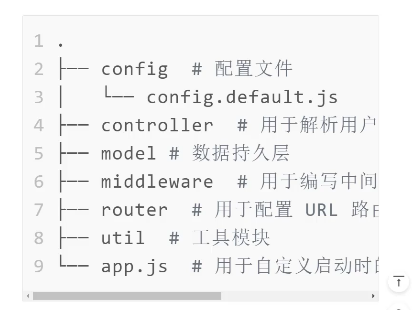
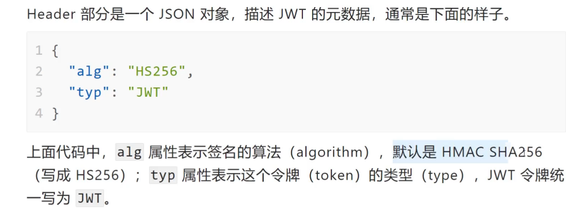
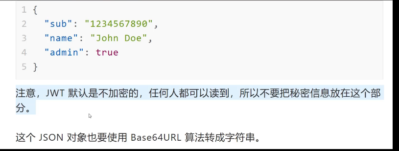
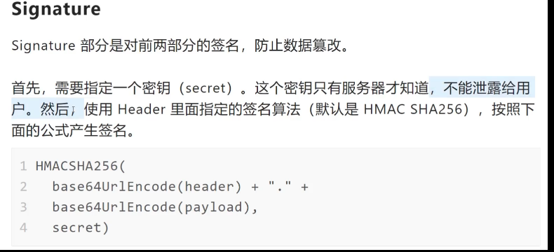
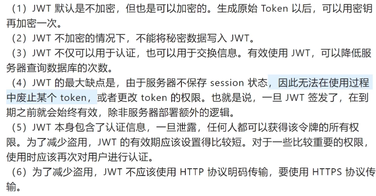

# 项目记录

## 1. 初始化项目，配置 TS

因为 require 这些是 node 的东西，我们需要安装 nodejs 的声明文件

- npm i @types/node typescript ts-node -D

然后想要执行 ts 文件，还需要安装 ts-node，用`ts-node`命令执行

- npm i ts-node -g

**使用 ts 编写 express**

```js
npm install @types/node --save-dev
npm install @types/express --save-dev
```

项目目录：



## 2. 配置中间件

## 用express-validator做数据校验

`https://express-validator.github.io/docs/`

基本用法，在路由中使用中间件：

```js
import { body, validationResult } from 'express-validator';

app.post(
  '/user',
  // username must be an email
  body('username').isEmail(),
  // password must be at least 5 chars long
  body('password').isLength({ min: 5 }),
  (req: express.Request, res: express.Response) => {
    // Finds the validation errors in this request and wraps them in an object with handy functions
    const errors = validationResult(req);
    if (!errors.isEmpty()) {
      return res.status(400).json({ errors: errors.array() });
    }

    User.create({
      username: req.body.username,
      password: req.body.password,
    }).then(user => res.json(user));
  },
);
```

我们可以把中间件抽离出来，校验规则抽离出来，分工明确

## md5加密

node自带的`crypto`模块，md5加密相同字符串加密出来的结果相同，所以可以用两种方法提高加密强度

1. 混入私钥
2. 二次加密

```js
import crypto from "crypto";

// md5加密算法，混入私钥增加加密强度，返回十六进制格式的值
export default (str: string) => {
  return crypto
    .createHash("md5")
    .update("zyan" + str)
    .digest("hex");
};
```


## JWT

> JSON Web Token

### 组成

存储在客户端,由三个部分组成

1. Header 头部
2. Payload 负载
3. Signature 签名

写成一行就是`Header.Payload.Signature`

#### Header



#### Payload



#### Signature



最后，将三部分用Base64算法编码，之所以用Base64是因为可能会将JWT放在URL中，像是+、/、=这些字符有特殊含义，要被替换掉

### 使用方式

1. 存储在Cookie中或localStorage中，此后每次与服务端通信都要带上JWT，可以放在Cookie里自动发送，但这样不能跨域。更好的做法是放在HTTP请求的头信息`Autorization`字段里面

   ```js
   Authorization:Bearer <token>
   ```

   

2. 跨域的时候，JWT就放在POST请求的数据体里面

### 特点



## jsonwebtoken

`npm install jsonwebtoken`

封装一下

```js
import jwt from "jsonwebtoken";
import { promisify } from "util";

export = {
  sign: promisify(jwt.sign),

  verify: promisify(jwt.verify),

  decode: promisify(jwt.decode),
};
```


# 踩过的坑

## 在 VSCode 终端中执行 tsc

1. 以管理员身份运行 vs code
2. ctrl + ` 打开终端
3. 输入 get-ExecutionPolicy，输出`Restricted`表示操作受限
4. 输入`set-ExecutionPolicy RemoteSigned`
5. 再次`get-ExecutionPolicy`，输出`RemoteSigned` 之后就可以在 vs code 执行 tsc 命令了

## 修改 ts 代码，自动重启服务

1. 安装`nodemon` `npm i nodemon ts-node -D`
2. 在`package.json`中配置`script`
   1. `"dev" :"nodemon --exec ts-node src/app.ts" `
   2. 在这个项目里`src/app.ts`是入口文件

## tsconfig.json 相关配置

```js
{
  "compilerOptions": {
    "incremental": true /* 启用增量编译，能提高编译速度 */,
    "tsBuildInfoFile": "./buildFile" //增量编译的文件放在哪（buildFile是文件名）
    "target": "es2016" /* 编译后的目标JS语言版本 */,
    "lib": [
      "es2018"
    ] /* 编译过程中需要引入的库文件的列表*/,
    /* Modules */
    "module": "commonjs" /* 指定生成的模块代码*/,
    "moduleResolution": "node",
    "outDir": "./dist/" /* 为所有编译后的文件指定输出文件夹 */,
    "noEmit": true /* 编译后不生成编译文件 */,
    "allowSyntheticDefaultImports": true /* 当模块没有默认导出的时候，允许'import x from y' . */,
    "esModuleInterop": true /* 通过导入内容创建命名空间，实现CommonJS和ES模块之间的互操作性 */,
    "forceConsistentCasingInFileNames": true /* 禁止对同一个文件的不一致的引用。 */,

    /* Type Checking */
    "strict": true /* Enable all strict type-checking options. */,
    "noImplicitAny": true /* 为隐含“any”类型的表达式和声明启用错误报告 */,
    "skipLibCheck": true /* 对所有.d.ts文件跳过类型检查 */
  }
}

```

## ts 编译相关

在`tsconfig.json`中配置了`"outDir": "./dist/"`后，`tsc 指定目录下的指定ts文件`会使这个配置失效，编译后的文件没有放在`dist`目录下，而是和编译前的 ts 文件在同一目录下。

正确的使用方法是直接`tsc`，对整个项目根目录下的文件编译。

想要直接运行 ts 文件，可以使用`ts-node`命令，前提是安装了`ts-node`

## mongoose6 中的 connect

mongoose6 废弃了`{useNewUrlParser: true, useUnifiedTopology:true}`等选项，且在 mongoose6 中，`connect`方法返回一个 promise，而不是一个实例
