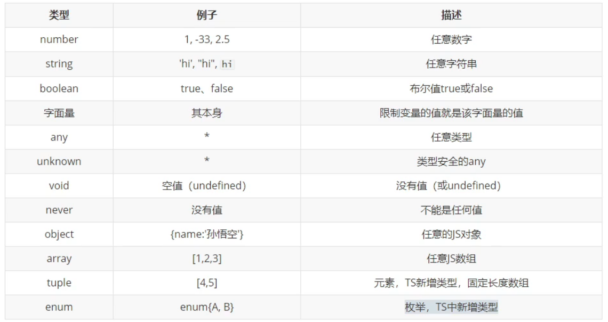
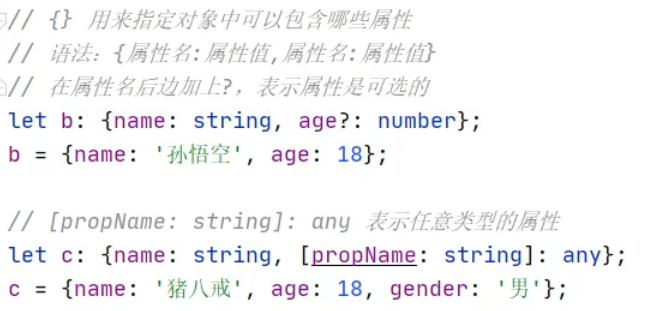
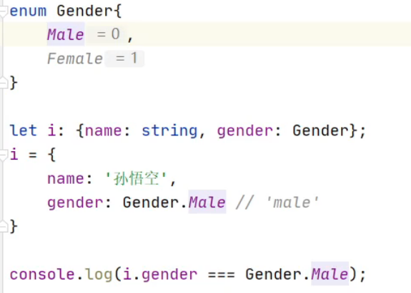
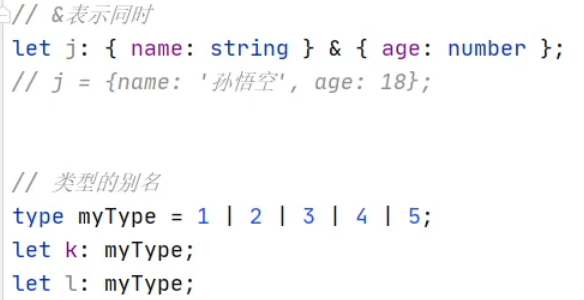

## TS中的类型

初始化变量时，TS解析器会自动判断变量的类型



- 字面量

  ```js
  let b: "male" | "female"
  b = "male"
  b = "female"
  b = 123 // false
  ```



- 元组：固定长度的数组

  ```js
  let h: [string, number]
  ```

- enum 枚举：可以提高程序程序可读性

  

- 别名

  

  

## TS编译选项

tsconfig.js

- “include”  用来指定哪些ts文件需要被编译
- 路径： ** 表示任意目录     |      * 表示任意文件
- exclude：不需要被编译的文件目录
- extend： 继承某个ts配置文件
- files： 指定被编译文件的列表

## TS面试题

1. any和unknown的区别

   any可以赋值给任意变量

   unknown就是一个类型安全的any，不能直接赋值给其他变量

2. 那如何将unknow赋值给其他变量？

   1. ```ts
      let e: unknown;
      e = "abc"
      let s : string;
      if(typeof e === "string"){
          s = e
      }
      ```

   2. 类型断言，可以用来告诉解析器变量的实际类型

      ```ts
      变量 as 类型
      <类型>变量
      s = e as string
      s = <string>e
      ```

      

