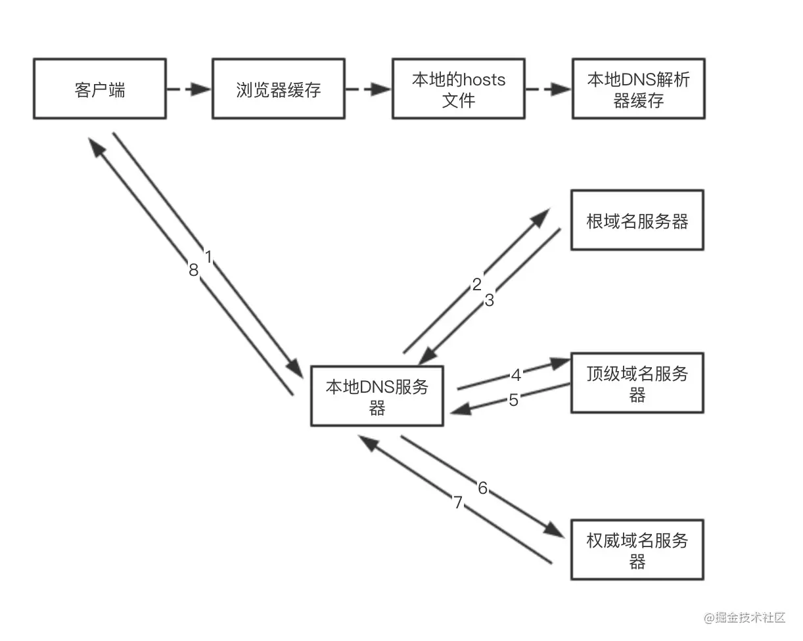

## 从输入URL到页面呈现发生了什么？——网络篇


### DNS域名解析

迭代查找和递归查找的过程




- ACK：此标志表示应答域有效，就是说前面所说的TCP应答号将会包含在TCP数据包中；有两个取值：0和1，为1的时候表示应答域有效，反之为0。TCP协议规定，只有ACK=1时有效，也规定连接建立后所有发送的报文的ACK必须为1。
- SYN(SYNchronization)：在连接建立时用来同步序号。当SYN=1而ACK=0时，表明这是一个连接请求报文。对方若同意建立连接，则应在响应报文中使SYN=1和ACK=1. 因此, SYN置1就表示这是一个连接请求或连接接受报文。
- FIN(finis）即完，终结的意思， 用来释放一个连接。当 FIN = 1 时，表明此报文段的发送方的数据已经发送完毕，并要求释放连接。
- MSL是Maximum Segment Lifetime英文的缩写，中文可以译为“报文最大生存时间”

## 从输入URL到页面呈现发生了什么？——网页渲染篇

### 构建DOM树

### 样式计算

格式化样式表 styleSheets

### 生成布局树（Layout Tree）

将DOM树和Layout Tree结合，确定元素的位置

### 建立图层树（Layer Tree）

一般情况下，节点的图层会默认属于父亲节点的图层(这些图层也称为**合成层**)。那什么时候会提升为一个单独的合成层呢？

有两种情况需要分别讨论，一种是**显式合成**，一种是**隐式合成**。

#### 显式合成

下面是`显式合成`的情况:

一、 拥有**层叠上下文**的节点。

层叠上下文也基本上是有一些特定的CSS属性创建的，一般有以下情况:

1. HTML根元素本身就具有层叠上下文。
2. 普通元素设置**position不为static**并且**设置了z-index属性**，会产生层叠上下文。
3. 元素的 **opacity** 值不是 1
4. 元素的 **transform** 值不是 none 
5. 元素的 **filter** 值不是 none
6. 元素的 **isolation** 值是isolate
   1. `isolation` CSS属性定义该元素是否必须创建一个新的层叠上下文
7. **will-change**指定的属性值为上面任意一个。(will-change的作用后面会详细介绍)

二、需要**剪裁**的地方。

比如一个div，你只给他设置 100 * 100 像素的大小，而你在里面放了非常多的文字，那么超出的文字部分就需要被剪裁。当然如果出现了滚动条，那么滚动条会被单独提升为一个图层。

#### 隐式合成

接下来是`隐式合成`，简单来说就是`层叠等级低`的节点被提升为单独的图层之后，那么`所有层叠等级比它高`的节点**都会**成为一个单独的图层。

这个隐式合成其实隐藏着巨大的风险，如果在一个大型应用中，当一个`z-index`比较低的元素被提升为单独图层之后，层叠在它上面的的元素统统都会被提升为单独的图层，可能会增加上千个图层，大大增加内存的压力，甚至直接让页面崩溃。这就是**层爆炸**的原理。这里有一个具体的例子，[点击打开](https://segmentfault.com/a/1190000014520786)。

值得注意的是，当需要`repaint`时，只需要`repaint`本身，而不会影响到其他的层。

### 二、生成绘制列表

接下来渲染引擎会将图层的绘制拆分成一个个绘制指令，比如先画背景、再描绘边框......然后将这些指令按顺序组合成一个待绘制列表，相当于给后面的绘制操作做了一波计划。

这里我以百度首页为例，大家可以在 Chrome 开发者工具中在设置栏中展开 `more tools`, 然后选择`Layers`面板，就能看到下面的绘制列表:


### 三、生成图块和生成位图

现在开始绘制操作，实际上在渲染进程中绘制操作是由专门的线程来完成的，这个线程叫**合成线程**。

绘制列表准备好了之后，渲染进程的主线程会给`合成线程`发送`commit`消息，把绘制列表提交给合成线程。接下来就是合成线程一展宏图的时候啦。

首先，考虑到视口就这么大，当页面非常大的时候，要滑很长时间才能滑到底，如果要一口气全部绘制出来是相当浪费性能的。因此，合成线程要做的第一件事情就是将图层**分块**。这些块的大小一般不会特别大，通常是 256 * 256 或者 512 * 512 这个规格。这样可以大大加速页面的首屏展示。

因为后面图块数据要进入 GPU 内存，考虑到浏览器内存上传到 GPU 内存的操作比较慢，即使是绘制一部分图块，也可能会耗费大量时间。针对这个问题，Chrome 采用了一个策略: 在首次合成图块时只采用一个**低分辨率**的图片，这样首屏展示的时候只是展示出低分辨率的图片，这个时候继续进行合成操作，当正常的图块内容绘制完毕后，会将当前低分辨率的图块内容替换。这也是 Chrome 底层优化首屏加载速度的一个手段。

顺便提醒一点，渲染进程中专门维护了一个**栅格化线程池**，专门负责把**图块**转换为**位图数据**。

然后合成线程会选择视口附近的**图块**，把它交给**栅格化线程池**生成位图。

生成位图的过程实际上都会使用 GPU 进行加速，生成的位图最后发送给`合成线程`。

### 四、显示器显示内容

栅格化操作完成后，**合成线程**会生成一个绘制命令，即"DrawQuad"，并发送给浏览器进程。

浏览器进程中的`viz组件`接收到这个命令，根据这个命令，把页面内容绘制到内存，也就是生成了页面，然后把这部分内存发送给显卡。为什么发给显卡呢？我想有必要先聊一聊显示器显示图像的原理。

无论是 PC 显示器还是手机屏幕，都有一个固定的刷新频率，一般是 60 HZ，即 60 帧，也就是一秒更新 60 张图片，一张图片停留的时间约为 16.7 ms。而每次更新的图片都来自显卡的**前缓冲区**。而显卡接收到浏览器进程传来的页面后，会合成相应的图像，并将图像保存到**后缓冲区**，然后系统自动将`前缓冲区`和`后缓冲区`对换位置，如此循环更新。

看到这里你也就是明白，当某个动画大量占用内存的时候，浏览器生成图像的时候会变慢，图像传送给显卡就会不及时，而显示器还是以不变的频率刷新，因此会出现卡顿，也就是明显的掉帧现象。


## 回流和重绘

我们首先来回顾一下`渲染流水线`的流程:


接下来，我们将来以此为依据来介绍重绘和回流，以及让更新视图的另外一种方式——合成。

### 回流

首先介绍`回流`。`回流`也叫`重排`。

#### 触发条件

简单来说，就是当我们对 DOM 结构的修改引发 DOM 几何尺寸变化的时候，会发生`回流`的过程。

具体一点，有以下的操作会触发回流:

1. 一个 DOM 元素的几何属性变化，常见的几何属性有`width`、`height`、`padding`、`margin`、`left`、`top`、`border` 等等, 这个很好理解。
2. 使 DOM 节点发生`增减`或者`移动`。
3. 读写 `offset`族、`scroll`族和 族属性的时候，浏览器为了获取这些值，需要进行回流操作。
4. 调用 `window.getComputedStyle` 方法。

#### 回流过程

依照上面的渲染流水线，触发回流的时候，如果 DOM 结构发生改变，则重新渲染 DOM 树，然后将后面的流程(包括主线程之外的任务)全部走一遍。


相当于将解析和合成的过程重新又走了一篇，开销是非常大的。

### 重绘

#### 触发条件

当 DOM 的修改导致了样式的变化，并且没有影响几何属性的时候，会导致`重绘`(`repaint`)。

#### 重绘过程

由于没有导致 DOM 几何属性的变化，因此元素的位置信息不需要更新，从而省去布局的过程。流程如下：


跳过了`生成布局树`和`建图层树`的阶段，直接生成绘制列表，然后继续进行分块、生成位图等后面一系列操作。

可以看到，重绘不一定导致回流，但回流一定发生了重绘。

### 合成

还有一种情况，是直接合成。比如利用 CSS3 的`transform`、`opacity`、`filter`这些属性就可以实现合成的效果，也就是大家常说的**GPU加速**。

#### GPU加速的原因

**在合成的情况下，会直接跳过布局和绘制流程，直接进入`非主线程`处理的部分，即直接交给`合成线程`处理**。交给它处理有两大好处:

1. 能够充分发挥`GPU`的优势。合成线程生成位图的过程中会调用线程池，并在其中使用`GPU`进行加速生成，而GPU 是擅长处理位图数据的。
2. 没有占用主线程的资源，即使主线程卡住了，效果依然能够流畅地展示。

### 实践意义

知道上面的原理之后，对于开发过程有什么指导意义呢？

1. 避免频繁使用 style，而是采用修改`class`的方式。

2. 使用`createDocumentFragment`进行批量的 DOM 操作。

   1. `DocumentFragments` 是DOM节点。它们不是主DOM树的一部分。通常的用例是创建文档片段，将元素附加到文档片段，然后将文档片段附加到DOM树。在DOM树中，文档片段被其所有的子元素所代替。

      因为文档片段存在于**内存中**，并不在DOM树中，所以将子元素插入到文档片段时不会引起页面[回流](https://developer.mozilla.org/zh-CN/docs/Glossary/Reflow)（对元素位置和几何上的计算）。因此，使用文档片段通常会带来更好的性能。

   2. ### **HTML**

      ```html
      <ul id="ul">
      </ul>
      ```

      ### **JavaScript**

      ```js
      var element  = document.getElementById('ul'); // assuming ul exists
      var fragment = document.createDocumentFragment();
      var browsers = ['Firefox', 'Chrome', 'Opera',
          'Safari', 'Internet Explorer'];
      
      browsers.forEach(function(browser) {
          var li = document.createElement('li');
          li.textContent = browser;
          fragment.appendChild(li);
      });
      
      element.appendChild(fragment);
      ```

      ### **结果**

      

3. 对于 resize、scroll 等进行防抖/节流处理。

4. 添加 will-change: tranform ，让渲染引擎为其单独实现一个图层，当这些变换发生时，仅仅只是利用合成线程去处理这些变换，而不牵扯到主线程，大大提高渲染效率。当然这个变化不限于`tranform`, 任何可以实现合成效果的 CSS 属性都能用`will-change`来声明。这里有一个实际的例子，一行`will-change: tranform`拯救一个项目，[点击直达](https://juejin.im/post/6844903966573068301)。

5. 减小合成层的尺寸

   对于一些纯色图层来说，我们可以使用 width 和 height 属性减小合成层的物理尺寸，然后再用 `transform: scale(…)` 放大，这样一来可以极大地减少层合成带来的内存消耗。


