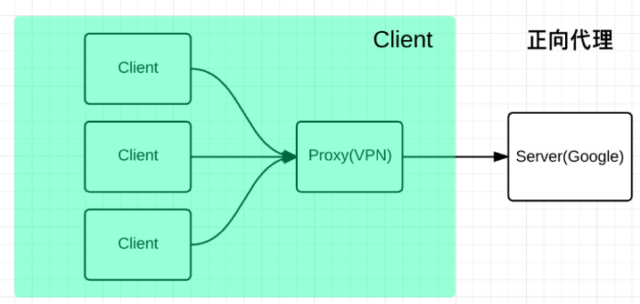
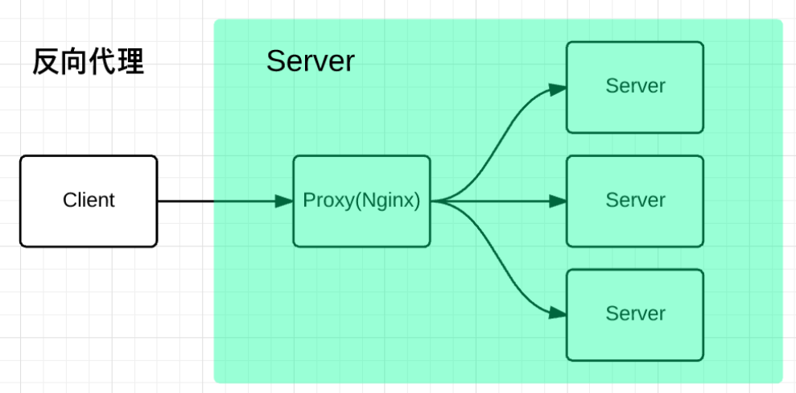
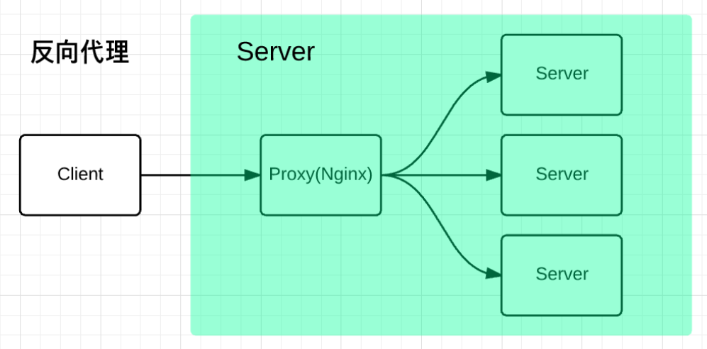

## 跨域是什么？

- 浏览器同源策略导致的问题
- 同源策略是浏览器的基本安全保障

## 何为同源？

**协议、域名、端口**三者一致才是同源，此外都是跨域

## 如何解决跨域？

### CORS

**跨域资源共享([CORS](https://link.juejin.cn/?target=https%3A%2F%2Fdeveloper.mozilla.org%2Fzh-CN%2Fdocs%2FGlossary%2FCORS))**

CORS头记住一个`Access-Control-Allow-Origin`

浏览器默认情况CORS是不带Cookie的，要额外设置

#### 简单请求

不会触发CORS预检请求

情况一：使用一下请求方法

- [`GET`](https://link.juejin.cn/?target=https%3A%2F%2Fdeveloper.mozilla.org%2Fzh-CN%2Fdocs%2FWeb%2FHTTP%2FMethods%2FGET)
- [`HEAD`](https://link.juejin.cn/?target=https%3A%2F%2Fdeveloper.mozilla.org%2Fzh-CN%2Fdocs%2FWeb%2FHTTP%2FMethods%2FHEAD)
- [`POST`](https://link.juejin.cn/?target=https%3A%2F%2Fdeveloper.mozilla.org%2Fzh-CN%2Fdocs%2FWeb%2FHTTP%2FMethods%2FPOST)

情况二：请求头为

- [`Accept`](https://link.juejin.cn/?target=https%3A%2F%2Fdeveloper.mozilla.org%2Fzh-CN%2Fdocs%2FWeb%2FHTTP%2FHeaders%2FAccept)
- [`Accept-Language`](https://link.juejin.cn/?target=https%3A%2F%2Fdeveloper.mozilla.org%2Fzh-CN%2Fdocs%2FWeb%2FHTTP%2FHeaders%2FAccept-Language)
- [`Content-Language`](https://link.juejin.cn/?target=https%3A%2F%2Fdeveloper.mozilla.org%2Fzh-CN%2Fdocs%2FWeb%2FHTTP%2FHeaders%2FContent-Language)

情况三：请求头为Content-Type且值设置为

- `text/plain`
- `multipart/form-data`
- `application/x-www-form-urlencoded`

#### 非简单请求

非简单请求的CORS请求，会在正式通信之前，增加一次HTTP查询请求，称为"预检"请求,该请求是 `option` 方法的，通过该请求来知道服务端是否允许跨域请求。

### JSONP

利用了 `script` 标签没有跨域限制的这个特性来完成跨域，简单兼容性好，但只支持GET请求

**流程**

1. 前端定义解析函数（例如 jsonpCallback=function(){....}）
2. 通过 params 形式包装请求参数，并且声明执行函数(例如 cb=jsonpCallback)
3. 后端获取前端声明的执行函数（jsonpCallback），并以带上参数并调用执行函数的方式传递给前端。

### Nginx

反向代理就是拿到客户端的请求，将请求转发给其他的服务器。

- 将Nginx服务器域名设置和客户端相同，做跳板机，客户端访问Nginx服务器就不会跨域，Nginx再将请求转发给其他服务器，此过程不会跨域。当响应返回时又将响应给到客户端，完成整个跨域请求。