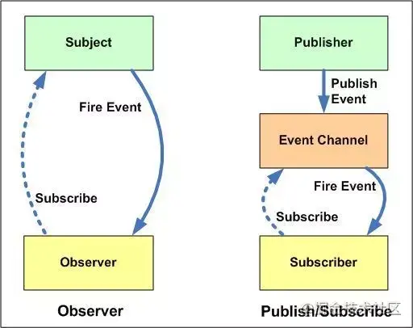
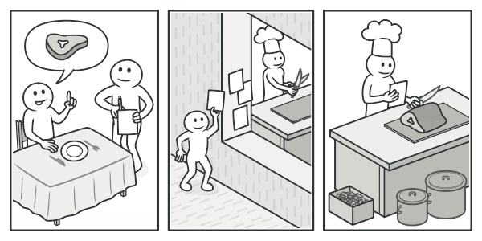
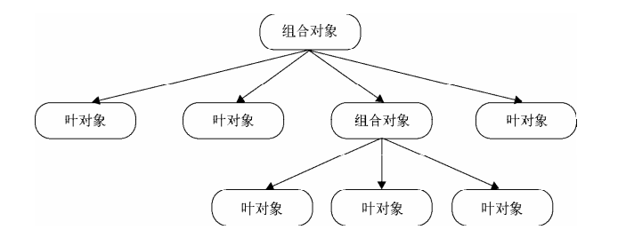
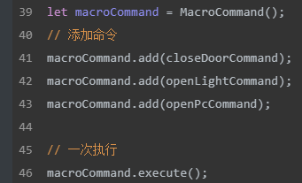
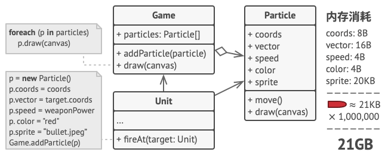
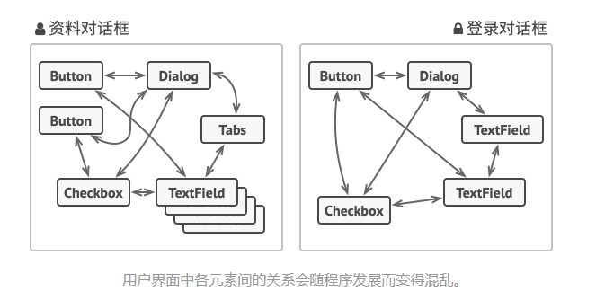
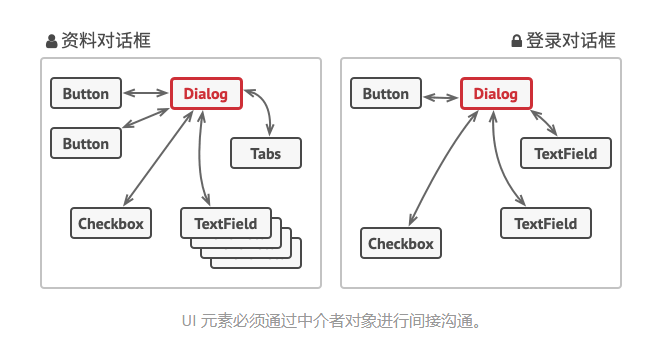
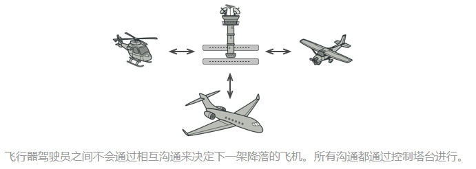

# 三类设计模式
- 创建型模式
  - 这类模式提供创建对象的机制， 能够提升已有代码的灵活性和可复用性。
- 结构型模式
  - 这类模式介绍如何将对象和类组装成较大的结构， 并同时保持结构的灵活和高效。
- 行为模式
  - 这类模式负责对象间的高效沟通和职责委派。

# 1. 单例模式

> 单例模式是创建型设计模式, 保证一个类仅有一个实例，并提供一个访问它的全局访问点

## 实现

实现一个单例模式并不复杂，无非就是用一个变量来标志当前是否已经为某个类创建过对象，如果是，则下次获取该类实例时直接返回之前创建的对象

实现一个单例模式，它的作用是负责在页面中创建唯一的div节点

### 用代理实现单例模式

```js
// 实现一个单例模式，它的作用是负责在页面中创建唯一的div节点
// 这是一个类
var CreateDiv = function (html) {
  this.html = html;
  this.init();
};

CreateDiv.prototype.init = function () {
  var div = document.createElement("div");
  div.innerHTML = this.html;
  document.body.appendChild(div);
};

var ProxySingletonCreateDiv = (function () {
  var instance;
  return function (html) {
    if (!instance) {
      instance = new CreateDiv(html);
    }
    return instance;
  };
})();

var a = new ProxySingletonCreateDiv("sven1");
var b = new ProxySingletonCreateDiv("sven2");

alert(a === b);
```

这段代码的注意点有两个

1. CreateDiv是一个类，init()是类方法，但在JS这样的无类语言中也许我们可以不需要这样一个类
2. 代理的作用是，CreateDiv是一个普通的类，我们既可以用它生产多个实例，也可以和代理组合起来以达到单例的效果

### JS中通用的惰性单例

单例模式的核心思想是**确保只有一个实例，并提供全局访问**

```js
// 单例模式的核心逻辑
var getSingle = function (fn) {
  var result;
  return function () {
    return result || (result = fn.apply(this, arguments));
  };
};

var someMethod = function () {
  return Symbol(1);
};

var createSingleMethod = getSingle(someMethod);

console.log(someMethod() === someMethod())   // false

console.log(createSingleMethod() === createSingleMethod())   // true
```

在这个例子中，someMethod要做的职责和管理单例的职责分别放在两个方法里（**职责单一**），这两个方法可以独立变化而不互相影响，当它们组合在一起的时候，就完成了创建唯一实例对象的功能。

## 优点

- 你可以保证一个类只有一个实例。
-  你获得了一个指向该实例的全局访问节点。
-  仅在首次请求单例对象时对其进行初始化。

# 2. 策略模式

## 定义

定义一系列的算法（业务），把它们一个个封装起来，并且使它们可以相互替换。

也就是将算法的使用与算法的实现分离开来

## 使用

基于策略模式的程序至少由两部分组成：**策略类**和**环境类**。

- 策略类封装了具体的算法，负责具体计算过程
- 环境类接受请求，并将请求委托给某一个策略类

使用策略模式可以消除原程序中大片的条件分支语句

## 优点

1. 利用组合、委托和多态等技术思想，可以有效避免多重条件选择语句
2. 提供来对开放-封闭原则的完美支持，将算法独立封装，使得它们易于切换、易于理解、易于扩展
3. 算法可复用在系统的其他地方

## 实现

```js
// 策略类
var strategies = {
  S: function (salary) {
    return salary * 4;
  },
  A: function (salary) {
    return salary * 3;
  },
  B: function (salary) {
    return salary * 2;
  },
};

// 环境类
var calculateBonus = function (level, salary) {
  return strategies[level](salary);
};

console.log(calculateBonus("S", 20000));
console.log(calculateBonus("A", 20000));
```

# 3. 代理模式

> 为一个对象提供一个代用品或占位符，以便控制对它的访问

## 保护代理和虚拟代理

**保护代理**

代理 B 可以帮助 A 过滤掉一些请求，A 只用专心于自己的业务

**虚拟代理（在JS中更常用）**

把一些开销很大的对象，延迟到真正需要它的时候才去创建，比如

- 虚拟代理实现图片懒加载，在图片加载好之前用一个占位图片代替

```js
  let myImage = (function () {
    let imgNode = document.createElement('img')
    document.body.appendChild(imgNode)

    return {
      setSrc: function (src) {
        imgNode.src = src
      }
    }
  })()

  let proxyImage = (function () {
    let img = new Image
    img.onload = function () {
      myImage.setSrc(this.src)
    }
    return {
      setSrc: function (src) {
        myImage.setSrc('./loading.jpg')
        img.src = src
      }
    }
  })()

  proxyImage.setSrc('https://img1.baidu.com/it/u=359638371,2587777304&fm=253&fmt=auto&app=120&f=JPEG?w=690&h=388')
```

这段代码符合**开放-封闭原则**，给img设置src和图片预加载两个功能在两个对象里，可以各自变化而不影响对方，如果我们不需要预加载了，只需要修改请求本体而不是代理即可。这样做降低了程序的耦合度

- 虚拟代理合并HTTP请求
  - 将在某一时间内的请求，如2s内的请求收集起来，一次性发送，减少请求次数，减轻服务器压力

## 代理和本体接口的一致性

应保证代理和本体接口的一致性

- 用户可以放心请求代理，而不必知道代理和本体的区别，只关心得到的结果
- 任何使用本体的地方都可以使用代理

## 缓存代理

可以为一些开销大的运算结果提供暂时的存储

```js
// 
let mult = function (...args) {
  console.log("计算乘积");
  let a = 1;
  for (let i = 0; i < args.length; i++) {
    a *= args[i];
  }
  return a;
};

console.log(mult(2, 3));
console.log(mult(2, 3, 4, 5));

let proxyMult = (function () {
  let cache = {};
  return function (...args) {
    let arg = args.join(',')
    if (arg in cache) {
      return cache[arg];
    }
    cache[arg] = mult.apply(this, args)
    return cache[arg];
  };
})();

console.log(proxyMult(1, 2, 3, 4, 5, 6));
// 第二次执行时就不用重复计算，而是从缓存里面拿
console.log(proxyMult(1, 2, 3, 4, 5, 6));
```

通过增加缓存代理，mult 函数依然专注于自己的职责——计算乘积，而缓存的功能由代理对象实现

# 4. 迭代器模式

> 提供一种方法顺序访问一个聚合对象中的各个元素,而又不需要暴露该对象的内部表示

## 内部迭代器和外部迭代器

### 内部迭代器

函数内部已经定义好了迭代规则,完全接手整个迭代过程,外部只需要一次初始调用

- 外界不用关心迭代器内部的实现,跟迭代器的交互也仅是一次初始调用
- 迭代规则已经确定,灵活度不及外部迭代器

```js
let each = function (arr, callback) {
  for (let i = 0, l = arr.length; i < l; i++) {
    // 把下标和元素当做参数传给callback函数
    callback.call(arr[i], i, arr[i]);
  }
};

each([1, 2, 3], function (i, n) {
  console.log([i, n]);
});
```


### 内部迭代器

- 必须显示地请求迭代下一个元素
- 增加了一些调用的复杂度,但也增强了迭代器的灵活性
- 可以手动控制迭代的过程或顺序

```js
let Iterator = function (obj) {
  let current = 0;

  let next = function () {
    current += 1;
  };

  let isDone = function () {
    return current >= obj.length;
  };

  let getCurrentItem = function () {
    return obj[current];
  };

  return {
    next,
    isDone,
    getCurrentItem,
    length: obj.length,
  };
};

// 判断两迭代对象是否相等
let compare = function (iterator1, iterator2) {
  if (iterator1.length !== iterator2.length) {
    console.log("iterator1 和 iterator2 不相等");
    return;
  }
  // 手动递归
  while (!iterator1.isDone() && !iterator2.isDone()) {
    if (iterator1.getCurrentItem() !== iterator2.getCurrentItem()) {
      throw new Error("iterator1 和 iterator2 不相等");
    }
    iterator1.next();
    iterator2.next();
  }
  console.log("iterator1 和 iterator2 相等");
};

let iterator1 = Iterator([1, 2, 3, 4]);
let iterator2 = Iterator([1, 2, 3, 4]);

compare(iterator1, iterator2);
```

# 5.发布-订阅模式

> 定义对象间的一种一对多的依赖关系，当一个对象的状态发生改变时，所有依赖于它的对象都将得到通知

实现发布-订阅模式三步走

1. 确定好谁充当发布者
2. 给发布者添加**缓存列表**，用于存放订阅者的回调函数以便通知订阅者
3. 当发布消息的时候，发布者会遍历缓存列表，依次触发里面存放的订阅者的回调函数

## 实现一个发布-订阅

```js
class EventEmiter {
  // key为发布对象的名字，value为订阅列表
  subscribes: Map<string, Array<Function>>;

  constructor() {
    this.subscribes = new Map();
  }

  // 事件订阅方法，订阅某个事件并将订阅方法加入到订阅列表
  listen(key: string, callback: Function) {
    const sub = this.subscribes.get(key) || [];
    sub.push(callback);
    this.subscribes.set(key, sub);
  }

  // 事件发布方法，根据key来找到订阅列表，并依次调用
  trigger(key: string, ...args: Array<any>) {
    const sub = this.subscribes.get(key);
    if (!sub || sub.length === 0) {
      return false;
    }
    const context = this;
    sub.forEach((fn) => {
      fn.apply(context, args);
    });
  }

  // 取消订阅，取消key对应的订阅列表中的某个订阅方法。
  remove(key: string, callback: Function) {
    const sub = this.subscribes.get(key);
    if (!sub) {
      return false;
    }
    const newSub = sub.filter((fn) => fn !== callback);
    this.subscribes.set(key, newSub);
  }
}

const eventEmiter = new EventEmiter();

eventEmiter.listen("sayhi", () => {
  console.log("hi");
});

eventEmiter.trigger("sayhi");
```

## 支持once订阅

即这个订阅者只会被通知一次，应该有一个标志`once`来判断这个订阅回调是否执行过，若执行过就将这个事件清除

`once`和`listen`有着相同的片段，将它们抽离出来成`addEvent`

```js
interface subscribeEvent {
  fn: Function;
  once: boolean;
}

export class EventEmiter {
  // key为发布对象的名字，value为订阅列表
  subscribes: Map<string, Array<subscribeEvent>>;

  constructor() {
    this.subscribes = new Map();
  }

  // 事件订阅方法，订阅某个事件并将订阅方法加入到订阅列表
  addEvent(key: string, callback: Function, once: boolean = false) {
    const sub = this.subscribes.get(key) || [];
    sub.push({ fn: callback, once });
    this.subscribes.set(key, sub);
  }

  // 多次订阅
  listen(key: string, callback: Function) {
    this.addEvent(key, callback);
  }

  // 一次订阅
  once(key: string, callback: Function) {
    this.addEvent(key, callback, true);
  }

  // 事件发布方法，根据key来找到订阅列表，并依次调用
  trigger(key: string, ...args: Array<any>) {
    const sub = this.subscribes.get(key);
    if (!sub || sub.length === 0) {
      return false;
    }
    const context = this;
    sub.forEach(({ fn }) => {
      fn.apply(context, args);
    });

    const newSub = sub.filter((item) => !item.once);
    this.subscribes.set(key, newSub);
  }

  // 取消订阅，取消key对应的订阅列表中的某个订阅方法。
  remove(key: string, callback: Function) {
    const sub = this.subscribes.get(key);
    if (!sub) {
      return false;
    }
    const newSub = sub.filter(({ fn }) => fn !== callback);
    this.subscribes.set(key, newSub);
  }
}

const eventEmiter = new EventEmiter();

eventEmiter.listen("say", () => {
  console.log("hi");
});

eventEmiter.once("say", () => {
  console.log("once");
});

eventEmiter.trigger("say");
eventEmiter.trigger("say");

```

## 先发布，再订阅

前面完成的发布-订阅模式都是先订阅一个消息，随后发布消息。但在某些场景下，我们可能需要先将发布的消息缓存起来，等到有对象来订阅的时候，再重新把消息发布给订阅者，如同离线消息，上线后可以重新收到这条消息。

更为可能的场景是，有时我们会订阅一些异步请求成功后发布的事件，因为我们不能保证异步请求的返回时间，如果异步请求返回的很快，而此时我们订阅相应事件的模块还没加载好（尤其是一些模块的惰性加载），那我们异步请求成功后的事件就错过订阅了。所以我们也许还需要一个方案，可以实现**先发布后订阅**的能力

**实现**

我们用`_cacheQueue`对还没订阅但先发布的事件进行缓存，我们发布的事件可能会携带参数，而且同一事件可能会发布多次，所以`_cacheQueue`的类型为

```ts
type CacheArgs = Array<any>;
_cacheQueue: Map<string, Array<CacheArgs>>;
```

在每次订阅的时候，事先看看缓存列表里有没有缓存的对应事件，如果有，就直接执行

```ts
interface SubscribeEvent {
  fn: Function;
  once: boolean;
}

type CacheArgs = Array<any>;

export class EventEmiter {
  subscribes: Map<string, Array<SubscribeEvent>>;
  _cacheQueue: Map<string, Array<CacheArgs>>;

  constructor() {
    this.subscribes = new Map();
    this._cacheQueue = new Map();
  }

  addEvent(key: string, callback: Function, once: boolean = false) {
    const cache = this._cacheQueue.get(key) || [];
    // 在每次订阅的时候，事先看看缓存列表里有没有缓存的对应事件，如果有，就直接执行
    if (cache?.length !== 0) {
      // args是一些参数数组
      cache.forEach((args) => {
        callback(...args);
      });
      this._cacheQueue.delete(key);
    }
    const sub = this.subscribes.get(key) || [];
    sub.push({ fn: callback, once });
    this.subscribes.set(key, sub);
  }

  listen(key: string, callback: Function) {
    this.addEvent(key, callback);
  }

  once(key: string, callback: Function) {
    this.addEvent(key, callback, true);
  }

  trigger(key: string, ...args: Array<any>) {
    const sub = this.subscribes.get(key) || [];

    // 订阅列表里没有对这个key的订阅
    if (sub.length === 0) {
      // 放入缓存列表中
      const cache = this._cacheQueue.get(key) || [];
      cache.push(args);
      this._cacheQueue.set(key, cache);
    } else {
      // 有对这个key的订阅，执行回调
      const context = this;

      sub.forEach(({ fn }) => {
        fn.apply(context, args);
      });

      const newSub = sub.filter((item) => !item.once);
      this.subscribes.set(key, newSub);
    }
  }

  remove(key: string, callback: Function) {
    const sub = this.subscribes.get(key);

    if (!sub) {
      return false;
    }

    const newSub = sub.filter(({ fn }) => fn !== callback);
    this.subscribes.set(key, newSub);
  }
}

const eventEmmiter = new EventEmiter();

// 先发布事件
eventEmmiter.trigger('calculate', 1, 2);
eventEmmiter.trigger('calculate', 3, 4);

eventEmmiter.listen('calculate', (a: number, b: number) => {
  console.log("事件发布后才订阅的, 计算的值为",a + b);
});
```

## 观察者模式

笔者认为发布-订阅模式和观察者模式的思想是很类似的，要说区别的话，观察者模式中的观察者只能接受同一个被观察者的消息，是一种**一对多**的关系；而发布-订阅模式是**多对多**的关系，它有一个中介，发布者发布事件名和参数到中介，中介向订阅者发送参数，订阅者不是直接订阅发布者



## 小结

发布-订阅模式是非常常见好用的设计模式，它有以下优点

- 时间上的解耦，事件发生时才去执行
- 对象上的解耦

缺点当然也有

- 创建订阅者本身需要消耗一定时间和内存
- 弱化对象之间的联系，可能会导致程序难以跟踪维护和理解

# 6. 命令模式

> 命令模式中的命令（command）指的是一个执行某些特定事情的指令

## 什么是命令模式

命令模式是一种**行为设计**模式，它可以将请求或简单操作转换为一个对象。这样做的好处是，我们可以根据不同的请求将方法参数化、**延迟请求执行**或**将其放入队列**中，且可以实现**撤销**操作。这样的文字有点难理解，我们举个现实中的例子。

## 在现实中理解命令模式

在购物中心逛了很久后，你走进了一家不错的餐厅，服务员给你递上了菜单，这时候，你有两种点菜方式。第一种是走到后厨去拍拍厨师的肩膀，跟他说“我要个汉堡”。第二种方式是你告诉服务员“一个汉堡”，然后服务员会记下你点的食物，去到厨房将订单贴在墙上，厨师拿到了订单后，根据订单来准备食物。如果你突然想再逛逛，你还可以跟服务员说，我一个小时候再来取餐，而不是现在就做。在这里，**订单就是一个命令**

很显然我们现实中的点餐都是第二种方式，因为你并不关心是哪个厨师做的汉堡，你只关心你能拿到汉堡（完成这个命令）。也就是说，订单解开了你（请求调用者）和厨师（请求接受者）之间的耦合



还有一个好处是，我们的订单**命令（command）**有着更长的生命周期，因为它被封装成了一个对象，我们可以在任意时刻去调用它，就像客人预定一小时后再开始做这个汉堡，换句话说，这个命令可以**延迟执行**了。

而假如正值饭点，订单太多了但厨师人手不够，那这些订单可以进行排队处理，第一个订单完成后再执行第二个，第三个，这样就是一个命令队列。命令队列的具体实现可以选择回调函数或发布-订阅模式，即在一个订单完成后通知队列，队列执行下一个命令。

同时，我们还可以给命令添加名为`undo`的方法来撤销命令，好比客人取消订单。

而很多时候，我们需要撤销一系列的命令，比如在一个围棋程序中，我们已经下了10步棋，需要一次性悔棋到5步。那我们可以将所有下棋命令存储到一个历史列表中，然后倒序依次执行这些命令的`undo`操作，直到循环到第五个命令。

我们甚至可以使用命令模式实现一个录播的功能，如使用Canvs画图，将执行过的命令存放在堆栈中，播放录像的时候只需要从头开始依次执行这些命令。

## 实现一个宏命令

通过上述举例，命令模式的样貌我们应该已经清晰了，那我们就实现一个简单的命令模式

```js
// 宏命令，一组命令的集合，可以一次执行一批命令

// 首先创建好各种Command（命令对象）
let closeDoorCommand = {
  execute: function () {
    console.log("关门");
  },
};

let openLightCommand = {
  execute: function () {
    console.log("开灯");
  },
};

let openPcCommand = {
  execute: function () {
    console.log("开电脑");
  },
};

// 定义宏命令MacroCommand
let MacroCommand = function () {
  return {
    commandsList: [],
    // 把子命令添加进宏命令对象
    add: function (command) {
      this.commandsList.push(command);
    },
    // 迭代这一组子命令对象，并且依次执行它们的 execute 方法
    execute: function () {
      this.commandsList.forEach((command) => {
        command.execute();
      });
    },
  };
};

let macroCommand = MacroCommand();
// 添加命令
macroCommand.add(closeDoorCommand);
macroCommand.add(openLightCommand);
macroCommand.add(openPcCommand);

// 一次执行
macroCommand.execute();
```

执行结果：

```js
关门
开灯
开电脑
```

宏命令是一组命令的集合，通过执行宏命令的方式，可以一次执行一批命令。我们还可以为宏命令添加撤销功能`undo`，跟 `macroCommand.execute` 类似，当调用 `macroCommand.undo` 方法时，宏命令里包含的所有子命令对象要依次执行各自的 `undo` 操作。不过注意，宏命令是命令模式与组合模式的联用产物。

## 小结

JavaScript 可以用高阶函数非常方便地实 现命令模式。命令模式在 JavaScript 语言中是一种隐形的模式。

命令模式是一种**行为设计**模式，它可以将请求或简单操作转换为一个对象。这样做的好处是，我们可以根据不同的请求将方法参数化、**延迟请求执行**或**将其放入队列**中，且可以实现**撤销**操作

# 7. 组合模式

组合模式是一种**结构型**设计模式，可以将对象组合成树状结构，且通过对象的多态性表现，使得用户对单个对象和组合对象的使用具有一致性。通过定义统一的方法名如`execute`可以实现对单个对象和组合对象调用相同的接口，完成不同的事情



从上图可看出，基本对象可以被组合成更复杂的组合对象，组合对象又可以被组合， 这样不断递归下去，这棵树的结构可以支持任意多的复杂度。每当对最上层的对象 进行一次请求时，实际上是在对整个树进行深度优先的搜索。而创建组合对象的程序员并不关心 这些内在的细节，往这棵树里面添加一些新的节点对象是非常容易的事情。

如命令模式中，往宏命令里添加命令



## JS中的组合模式

​		前面说到，组合模式最大的优点在于可以一致地对待组合对象和基本对象。客户不需要知道当前处理的是宏命令还是普通命令，只要它是一个命令，并且有 execute 方法，这个命令就可以被添加到树中。在Java中，可以通过抽象类来确保组合对象和叶对象拥有同样的方法。

​		但在JS中，我们很难保证组合对象和叶对象拥有同样的方法，JS中通常需要我们用鸭子类型的思想对它们进行接口检查，这样难免缺乏严谨性（或许使用TS就能避免这些烦恼）

## 透明性带来的安全问题

​		组合模式的透明性使得发起请求的客户不用去顾忌树中组合对象和叶对象的区别，但它们在 本质上有是区别的。 组合对象可以拥有子节点，叶对象下面就没有子节点， 所以我们也许会发生一些误操作， 比如试图往叶对象中添加子节点。解决方案通常是给叶对象也增加 add 方法，并且在调用这个方 法时，抛出一个异常来及时提醒客户，代码如下：

```js
let MacroCommand = function () {
  return {
    commandsList: [],
    add: function (command) {
      this.commandsList.push(command);
    },
    execute: function () {
      for (var i = 0, command; (command = this.commandsList[i++]); ) {
        command.execute();
      }
    },
  };
};
var openTvCommand = {
  execute: function () {
    console.log("打开电视");
  },
  add: function () {
    throw new Error("叶对象不能添加子节点");
  },
};
var macroCommand = MacroCommand();
macroCommand.add(openTvCommand);
openTvCommand.add(macroCommand); // Uncaught Error: 叶对象不能添加子节点
```

## 一些值得注意的地方

1. 组合模式不是父子关系

   组合模式是一种 HAS-A（聚合）的关系，而不是 IS-A。组合对象包含一组叶对象，但 Leaf 并不是 Composite 的子类。组合对象把请求委托给它所包含的所有叶对象，它们能够合作的关键 是拥有相同的接口。

2. 对叶对象操作的一致性 

   组合模式除了要求组合对象和叶对象拥有相同的接口之外，还有一个必要条件，就是对一组 叶对象的操作必须具有一致性。 比如公司要给全体员工发放元旦的过节费 1000 块，这个场景可以运用组合模式，但如果公 司给今天过生日的员工发送一封生日祝福的邮件，组合模式在这里就没有用武之地了，除非先把 今天过生日的员工挑选出来。只有用一致的方式对待列表中的每个叶对象的时候，才适合使用组合模式。  

3. 双向映射关系 

   发放过节费的通知步骤是从公司到各个部门，再到各个小组，最后到每个员工的邮箱里。这 本身是一个组合模式的好例子，但要考虑的一种情况是，也许某些员工属于多个组织架构。比如 某位架构师既隶属于开发组，又隶属于架构组，对象之间的关系并不是严格意义上的层次结构， 在这种情况下，是不适合使用组合模式的，该架构师很可能会收到两份过节费。

   这种复合情况下我们必须给父节点和子节点建立双向映射关系，一个简单的方法是给小组和员 工对象都增加集合来保存对方的引用。但是这种相互间的引用相当复杂，而且对象之间产生了过多 的耦合性，修改或者删除一个对象都变得困难，此时我们可以引入中介者模式来管理这些对象。

4. 用职责链模式提高组合模式性能

   在组合模式中，如果树的结构比较复杂，节点数量很多，在遍历树的过程中，性能方面也许 表现得不够理想。有时候我们确实可以借助一些技巧，在实际操作中避免遍历整棵树，有一种现 成的方案是借助职责链模式。职责链模式一般需要我们手动去设置链条，但在组合模式中，父对 象和子对象之间实际上形成了天然的职责链。让请求顺着链条从父对象往子对象传递，或者是反 过来从子对象往父对象传递，直到遇到可以处理该请求的对象为止，这也是职责链模式的经典运 用场景之一。

> 引自《JavaScript设计模式与开发实践》

## 适用场景

 **如果你需要实现树状对象结构， 可以使用组合模式。**

 组合模式为你提供了两种共享公共接口的基本元素类型： 简单叶节点和复杂容器。 容器中可以包含叶节点和其他容器。 这使得你可以构建树状嵌套递归对象结构。在组合模式中增加和删除树的节点非常方便

**如果你希望客户端代码以相同方式处理简单和复杂元素， 可以使用该模式。**

 组合模式中定义的所有元素共用同一个接口。 在这一接口的帮助下， 客户端不必在意其所使用的对象是组合对象还是叶对象。不必写一堆if、else语句来分别处理它们

## 优缺点

**优点**

- 你可以利用多态和递归机制更方便地使用复杂树结构。
- *开闭原则*。 无需更改现有代码， 你就可以在应用中添加新元素， 使其成为对象树的一部分。

**缺点**

- 对于功能差异较大的类， 提供公共接口或许会有困难。 在特定情况下， 你需要过度一般化组件接口， 使其变得令人难以理解。
- 系统中的每个对象可能看着差不多，它们的区别只有在运行的时候才会显现出来，会使代码难以理解

# 8. 享元模式

享元（flyweight）模式是一种用于性能优化的模式，如果系统中因为创建了大量类似的对象而导致内存占用过高，享元模式就非常有用了。

应用该模式所获的收益大小取决于使用它的方式和情景。 它在下列情况中最有效：

- 程序需要生成数量巨大的相似对象
- 这将耗尽目标设备的所有内存
- 对象中包含可抽取且能在多个对象间共享的重复状态。

## 解决什么问题

试想你开发了一款简单的游戏： 玩家们在地图上移动并相互射击。 你决定实现一个真实的粒子系统， 并将其作为游戏的特色。 大量的子弹、 导弹和爆炸弹片会在整个地图上穿行， 为玩家提供紧张刺激的游戏体验。

开发完成后，你将游戏编译后发送给了一个朋友试玩，尽管该游戏在你的电脑上完美运行， 但是你的朋友却无法长时间进行游戏，总是会在最后崩溃。最后你发现是朋友的设备性能远比不上你的电脑，崩溃的原因是内存容量不足。

而问题就出现在粒子系统上，每个粒子都由包含完整数据的独立对象来表示，每次都要创建新的粒子，内存撑不住，就崩溃了。



我们观察这个粒子类，发现color和sprite这两个成员变量所消耗的内存比其他变量多得多，且这两个数据几乎不变。那么我们可以把不变的属性划分为内部状态，而可能改变的属性划分为外在状态。


内部状态和外部状态有如下特点：

- 内部状态存储于对象内部。 
- 内部状态可以被一些对象共享。  
- 内部状态独立于具体的场景，通常不会改变。 
- 外部状态取决于具体的场景，并根据场景而变化，外部状态不能被共享

剥离了外部状态的对象成为共享对象，享元模式是一种用时间换空 的优化模式，但却可以大大减少系统中的对象数量，相比之下，这点时间或许是微不足道的。

## 适用性

- 一个程序中使用了大量的相似对象。 
- 由于使用了大量对象，造成很大的内存开销。 
- 对象的大多数状态都可以变为外部状态。 
- 剥离出对象的外部状态之后，可以用相对较少的共享对象取代大量对象。

## 实现方式

1. 将需要改写为享元的类成员变量拆分为两个部分：
   - 内在状态： 包含不变的、 可在许多对象中重复使用的数据的成员变量。
   - 外在状态： 包含每个对象各自不同的情景数据的成员变量
2. 保留类中表示内在状态的成员变量， 并将其属性设置为不可修改。 这些变量仅可在构造函数中获得初始数值。
3. 找到所有使用外在状态成员变量的方法， 为在方法中所用的每个成员变量新建一个参数， 并使用该参数代替成员变量。
4. 你可以有选择地创建工厂类来管理享元缓存池， 它负责在新建享元时检查已有的享元。 如果选择使用工厂， 客户端就只能通过工厂来请求享元， 它们需要将享元的内在状态作为参数传递给工厂。
5. 客户端必须存储和计算外在状态 （情景） 的数值， 因为只有这样才能调用享元对象的方法。 为了使用方便， 外在状态和引用享元的成员变量可以移动到单独的情景类中。

## 对象池

对象池维 护一个装载空闲对象的池子，如果需要对象的时候，不是直接 new，而是转从对象池里获取。如 果对象池里没有空闲对象，则创建一个新的对象，当获取出的对象完成它的职责之后， 再进入池子等待被下次获取

在 Web 前端开 发中，对象池使用最多的场景大概就是跟 DOM 有关的操作。很多空间和时间都消耗在了 DOM 节点上，如何避免频繁地创建和删除 DOM 节点就成了一个有意义的话题

对象池是另外一种性能优化方案，它跟享元模式有一些相似之处，但没有分离内部状态和外 部状态这个过程

## 小结

享元模式是为解决性能问题而生的模式，可以很好地解决大量对象带来的性能问题。

# 9. 职责链模式

> 使多个对象都有机会处理请求，从而避免请求的发送者和接受者之间的耦合关系，将这些对象连成一条链，并沿着这条链传递该请求，直到有一个对象处理它为止

在职责链模式中，请求发送者只需要知道链中的第一个节点，从而弱化了发送者和一组接受者之间的强联系


## 代码中理解职责链

看一段代码，这是一个订单系统中的下单流程

- orderType：表示订单类型（定金用户或者普通购买用户），code 的值为 1 的时候是 500 元 定金用户，为 2 的时候是 200 元定金用户，为 3 的时候是普通购买用户。 
- pay：表示用户是否已经支付定金，值为 true 或者 false, 虽然用户已经下过 500 元定金的 订单，但如果他一直没有支付定金，现在只能降级进入普通购买模式。 
- stock：表示当前用于普通购买的手机库存数量，已经支付过 500 元或者 200 元定金的用 户不受此限制

```js
let order = function (orderType, pay, stock) {
  if (orderType === 1) {
    // 500 元定金购买模式
    if (pay === true) {
      // 已支付定金
      console.log("500 元定金预购, 得到 100 优惠券");
    } else {
      // 未支付定金，降级到普通购买模式
      if (stock > 0) {
        // 用于普通购买的手机还有库存
        console.log("普通购买, 无优惠券");
      } else {
        console.log("手机库存不足");
      }
    }
  } else if (orderType === 2) {
    // 200 元定金购买模式
    if (pay === true) {
      console.log("200 元定金预购, 得到 50 优惠券");
    } else {
      if (stock > 0) {
        console.log("普通购买, 无优惠券");
      } else {
        console.log("手机库存不足");
      }
    }
  } else if (orderType === 3) {
    if (stock > 0) {
      console.log("普通购买, 无优惠券");
    } else {
      console.log("手机库存不足");
    }
  }
};
order(1, true, 500); // 输出： 500 元定金预购, 得到 100 优惠券
```

通过这一大段分支语句，我们能够得到想要的运行结果，但这样的代码无疑会让维护变得非常困难。而且若是之后想要添加新的功能，也会不那么方便，使用职责链模式可以很好的解决这些问题

```js
// 先定义节点函数
let order500 = function (orderType, pay, stock) {
  if (orderType === 1 && pay === true) {
    console.log("500元定金预购，得到一百优惠券");
  } else {
    return "nextSuccessor"; // 将请求推给下一个节点
  }
};

let order200 = function (orderType, pay, stock) {
  if (orderType === 2 && pay === true) {
    console.log("200元定金预购，得到50优惠券");
  } else {
    return "nextSuccessor";
  }
};

let orderNormal = function (orderType, pay, stock) {
  if (stock > 0) {
    console.log("普通购买，无优惠券");
  } else {
    console.log("手机库存不足");
  }
};

// 定义职责链节点
let Chain = function (fn) {
  // 当前节点函数
  this.fn = fn;
  // 在链中的下一个节点
  this.successor = null;
};

// 指定链中的下一个节点
Chain.prototype.setNextSuccessor = function (successor) {
  return (this.successor = successor);
};

// 传递请求给某个节点
Chain.prototype.passRequest = function () {
  let ret = this.fn.apply(this, arguments);

  if (ret === "nextSuccessor") {
    // 将请求继续向后传递
    return (
      this.successor &&
      this.successor.passRequest.apply(this.successor, arguments)
    );
  }
  return ret;
};

// 将三个订单函数分别包装成职责链的节点
let chainOrder500 = new Chain(order500)
let chainOrder200 = new Chain(order200)
let chainOrderNormal = new Chain(orderNormal)

// 指定节点在职责链中的顺序，将节点连成链
chainOrder500.setNextSuccessor(chainOrder200)
chainOrder200.setNextSuccessor(chainOrderNormal)

// 请求只用传递给第一个节点
chainOrder500.passRequest(1, true, 500)
chainOrder500.passRequest(2, true, 500)
chainOrder500.passRequest(3, true, 500)
chainOrder500.passRequest(1, false, 0)
```

这样重构过后，我们可以自由灵活地增加、移除和修改链中的节点顺序，假如某天网站运营人员 又想出了支持 300 元定金购买，那我们就在该链中增加一个节点即可

```js
var order300 = function () {
  // 具体实现略
};
chainOrder300 = new Chain(order300);
chainOrder500.setNextSuccessor(chainOrder300);
chainOrder300.setNextSuccessor(chainOrder200);
```


## 适用场景

- 当程序需要使用不同方式处理不同种类请求， 而且请求类型和顺序预先未知时， 可以使用责任链模式。
  - 该模式能将多个处理者连接成一条链。 接收到请求后， 它会 “询问” 每个处理者是否能够对其进行处理。 这样所有处理者都有机会来处理请求。
- 当必须按顺序执行多个处理者时， 可以使用该模式。
  - 无论你以何种顺序将处理者连接成一条链， 所有请求都会严格按照顺序通过链上的处理者。
- 如果所需处理者及其顺序必须在运行时进行改变， 可以使用责任链模式。
  - 如果在处理者类中有对引用成员变量的设定方法， 你将能动态地插入和移除处理者， 或者改变其顺序。

## 优缺点

**优点**

-  你可以控制请求处理的顺序，可以手动指定起始节点，这在普通的分支语句下是做不到的。
-  *单一职责原则*。 你可对发起操作和执行操作的类进行解耦（解耦了发送者和 N 个接受者之间的复杂关系）。
-  *开闭原则*。 你可以在不更改现有代码的情况下在程序中新增处理者。

**缺点**

- 部分请求可能未被处理。
- 职责链过长会带来性能损耗

# 10. 中介者模式

> **中介者模式**是一种行为设计模式， 能让你减少对象之间混乱无序的依赖关系。 该模式会限制对象之间的直接交互， 迫使它们通过一个中介者对象进行合作。

当程序的规模增大，对象会越来越多，它 们之间的关系也越来越复杂，难免会形成网状的交叉引用,当我们改变或删除其中一个对象的时候，很可能需要通知所有引用到它的对象



中介者模式的作用就是解除对象与对象之间的紧耦合关系，通过中介者对象重定向调用行为， 以间接的方式进行合作。 最终， 组件仅依赖于一个中介者类， 无需与多个其他组件相耦合



## 现实中的中介者

中介者就好比机场的指挥塔，如果没有指挥塔，每一架飞机起飞降落前都要和周围的所有飞机通信才能确定航线和飞行情况，这肯定是很混乱的。而塔台作为调停者，知道每一架飞机的飞行情况，可以安排所有飞机的起降时间和航线。



## 适用场景

- 当一些对象和其他对象紧密耦合以致难以对其进行修改时， 可使用中介者模式。
  - 该模式让你将对象间的所有关系抽取成为一个单独的类， 以使对于特定组件的修改工作独立于其他组件。
- 当组件因过于依赖其他组件而无法在不同应用中复用时， 可使用中介者模式。
  - 应用中介者模式后， 每个组件不再知晓其他组件的情况。 尽管这些组件无法直接交流， 但它们仍可通过中介者对象进行间接交流。 如果你希望在不同应用中复用一个组件， 则需要为其提供一个新的中介者类。
- 如果为了能在不同情景下复用一些基本行为， 导致你需要被迫创建大量组件子类时， 可使用中介者模式。
  - 由于所有组件间关系都被包含在中介者中， 因此你无需修改组件就能方便地新建中介者类以定义新的组件合作方式。

## 中介者模式的优缺点

### 优点

-  *单一职责原则*。 你可以将多个组件间的交流抽取到同一位置， 使其更易于理解和维护。
-  *开闭原则*。 你无需修改实际组件就能增加新的中介者。
-  你可以减轻应用中多个组件间的耦合情况。
-  你可以更方便地复用各个组件。

### 缺点

- 系统中会新增一个中介者对象，对象之间交互的复杂性转移成了中介者对象的复杂性。中介者对象自身往往就是一个难以维护的对象

模块之间有一些依赖关系很正常，我们应该衡量对象之间的耦合程度，再考虑是否要使用中介者对象

# 11. 装饰者模式

> 装饰者模式可以动态地给某给对象添加一些额外的职责，而不会影响从这个类中派生的其他对象

传统的面向对象语言中，常使用继承给对象添加功能，但继承并不灵活，还可能带来一些其他问题：一方面会导致超类和子类之间存在强耦合性，当超类改变时，子类也会随之改变；另一方面，继承这种功能复用方式通常被称为“白箱复用”，“白箱”是相对可见性而言的， 在继承方式中，超类的内部细节是对子类可见的，继承常常被认为破坏了封装性

## 适用场景

- 如果你希望在无需修改代码的情况下即可使用对象， 且希望在运行时为对象新增额外的行为， 可以使用装饰模式。

  - 装饰能将业务逻辑组织为层次结构， 你可为各层创建一个装饰， 在运行时将各种不同逻辑组合成对象。 由于这些对象都遵循通用接口， 客户端代码能以相同的方式使用这些对象

- 如果用继承来扩展对象行为的方案难以实现或者根本不可行， 你可以使用该模式。
  - 许多编程语言使用 `final`最终关键字来限制对某个类的进一步扩展。 复用最终类已有行为的唯一方法是使用装饰模式： 用封装器对其进行封装。

## JS实现

在JS中，我们想在不改变函数源代码的情况下给函数增加功能，可以很方便的实现——通过保存原引用的方式改写某个函数

```js
let a = function () {
  console.log(1);
};

let _a = a;

a = function () {
  _a();
  console.log(2);
};

a();
```

但这样实现虽然简单，却仍有其不方便的地方，如果我们想`_a()`在`console.log(2)`之后执行，那我们得改写函数。每次我们想使用装饰者模式的地方，都要手动维护一个中间变量。而且还可能遇到this被劫持的问题。

## 用AOP装饰函数

把一个函数“动态织入”到另一个函数中，通过把行为依照职责划分成粒度更细的函数，随后用装饰模式把它们合并到一起。这有助于帮助我们编写一个松耦合和高复用性的系统

```js
Function.prototype.before = function (befornFn) {
  let __self = this; // 保存原函数的引用
  return function (...args) {
    befornFn.apply(this, args); // 执行新函数，同时保证this不被劫持，还是原来的this

    // 执行原函数并返回原函数的执行结果，保证原函数this不被劫持
    return __self.apply(this, args);
  };
};

Function.prototype.after = function (afterFn) {
  let __self = this; // 保存原函数的引用
  return function (...args) {
    let ret = __self.apply(this, args);
    afterFn.apply(this, args); // 执行新函数，同时保证this不被劫持，还是原来的this

    // 执行原函数并返回原函数的执行结果，保证原函数this不被劫持
    return ret;
  };
};
```

测试一下

```js
let a = function () {
  console.log(1);
};

a = a.before(() => {
  console.log(0);
});

a = a.after(() => {
  console.log(2);
});

a();
```

## 装饰模式的优点

-  无需创建新子类即可扩展对象的行为。
-  可以在运行时添加或删除对象的功能。
-  可以用多个装饰封装对象来组合几种行为。
-  *单一职责原则*。 可以将实现了许多不同行为的一个大类拆分为多个较小的类。

# 12. 状态模式

> **状态模式**是一种行为设计模式， 让你能在一个对象的内部状态变化时改变其行为， 使其看上去就像改变了自身所属的类一样。

状态模式的关键是**把事物的每种状态都封装成单独的类**，跟此种状态有关的行为都被封装在这个类的内部，并将请求委托给当前的状态对象。

它可以使每一种状态和它对应的行为之间的关系局部化，这些行为被分散和封装在各自对应的状态类之中， 便于阅读和管理代码。

## 适用场景

- 如果对象需要根据自身当前状态进行不同行为， 同时状态的数量非常多且与状态相关的代码会频繁变更的话， 可使用状态模式。
  - 状态模式建议你将所有特定于状态的代码抽取到一组独立的类中。 这样一来， 你可以在独立于其他状态的情况下添加新状态或修改已有状态， 从而减少维护成本。
- 如果某个类需要根据成员变量的当前值改变自身行为， 从而需要使用大量的条件语句时， 可使用该模式。
  - 状态模式会将这些条件语句的分支抽取到相应状态类的方法中。 同时， 你还可以清除主要类中与特定状态相关的临时成员变量和帮手方法代码。
- 当相似状态和基于条件的状态机转换中存在许多重复代码时， 可使用状态模式。
  - 状态模式让你能够生成状态类层次结构， 通过将公用代码抽取到抽象基类中来减少重复。

## 状态模式的优缺点

- *单一职责原则*。 将与特定状态相关的代码放在单独的类中。
-  *开闭原则*。 无需修改已有状态类和上下文就能引入新状态。
-  通过消除臃肿的状态机条件语句简化上下文代码。